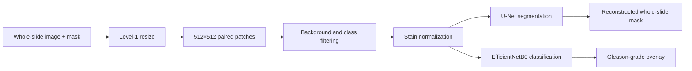

# Prostate Cancer Detection Model

A computational-pathology research prototype for locating cancer in prostate-biopsy whole-slide images and exploring Gleason-grade classification.

> This repository is an experimental research project, not a clinical diagnostic tool. It has not been validated for patient care.

## Pipeline

The preprocessing code resizes slides and masks to matching dimensions, splits them into paired 512×512 patches, removes unusable background regions, and reduces class imbalance by selecting patches that contain annotated cancer. Training code then applies stain normalization before segmentation or classification.

## Repository guide

| File | Purpose |
| --- | --- |
| `resizing.py` | Resize whole-slide images and masks, create paired patches, and filter background or empty regions |
| `normalization.py` | Normalize histology stain appearance using optical-density decomposition |
| `Model.py` | Train a U-Net segmentation model and reconstruct a whole-slide cancer mask from patch predictions |
| `Gleason.py` | Train an EfficientNetB0-based classifier and combine grade predictions with segmentation output |

## Main technologies

- Python
- TensorFlow / Keras
- OpenCV and Pillow
- OpenSlide
- NumPy, scikit-image, and scikit-learn

## Data assumptions

The scripts expect:

- whole-slide images readable by OpenSlide;
- pixel-aligned annotation masks after resizing;
- class-labelled folders for Gleason-grade training; and
- enough local storage to materialize 512×512 image and mask patches.

No dataset or trained weights are included in this repository.

## Reproducing the work

The current files preserve the original research workflow and contain local filesystem paths. Before running them, replace those paths with locations for your own slides, masks, train/validation splits, and model outputs. The scripts are not yet packaged as a one-command training pipeline.

A typical run follows this order:

1. Configure input and output paths in `resizing.py`.
2. Generate matching image and mask patches.
3. Configure training and validation directories in `Model.py` or `Gleason.py`.
4. Train the segmentation model, the grade classifier, or both.
5. Use the prediction helpers to reconstruct slide-level outputs.

## Current limitations

- Dataset preparation depends on machine-specific paths.
- Dependency versions and trained weights are not recorded.
- The repository does not publish a held-out benchmark or clinical validation result.
- Preprocessing, training, and evaluation are combined in research scripts rather than a reusable package.

The next engineering step is to move paths and hyperparameters into configuration, pin dependencies, separate training from inference, and add a small reproducible example with tests.
